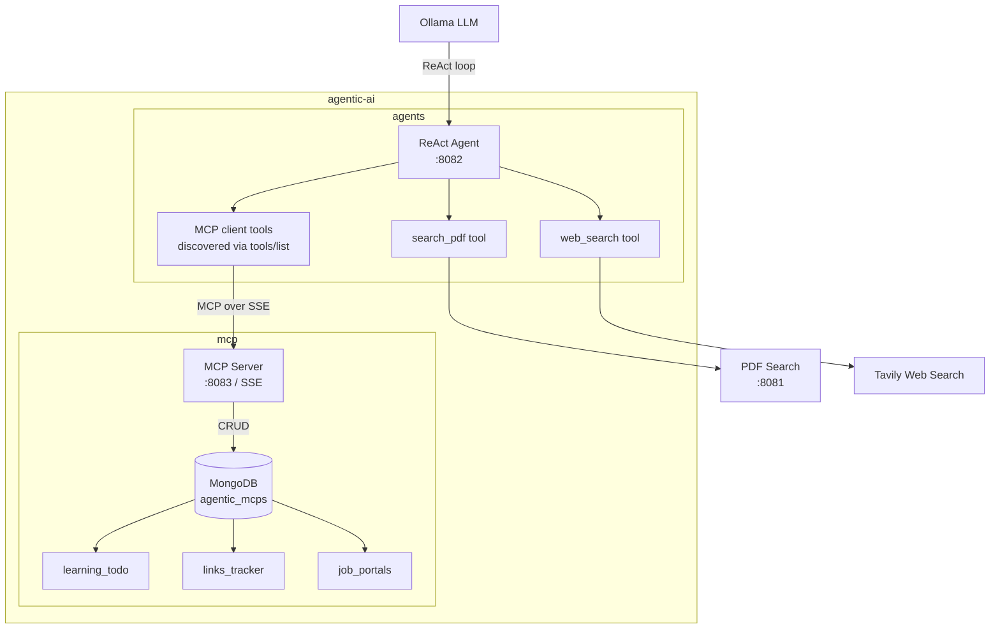
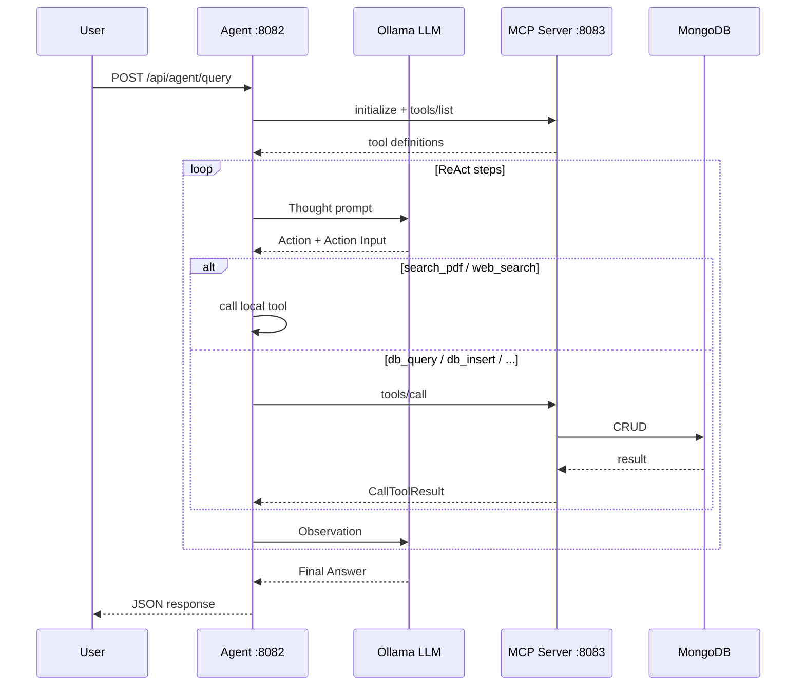

# agentic-ai

A local agentic AI system built in Go. An LLM-powered ReAct agent that reasons over PDF documents, the web, and a MongoDB database — all wired together via the Model Context Protocol (MCP).

---

## Repository Structure

```
agentic-ai/
├── agents/   — ReAct agent (Ollama + PDF search + web search + MCP client)
└── mcp/      — MongoDB MCP server (exposes agentic_mcps DB as MCP tools)
```

---

## Architecture



---

## How it works



---

## Modules

### [`agents/`](./agents/)
ReAct loop agent powered by a local Ollama model. On startup it connects to the MCP server, calls `tools/list` to discover available DB tools, and injects their real descriptions into the system prompt.

| Tool | Source |
|---|---|
| `search_pdf` | Local PDF vector search endpoint |
| `web_search` | Tavily API |
| `list_collections`, `query_documents`, `insert_document`, `update_document`, `delete_document` | Discovered from MCP server at runtime |

### [`mcp/`](./mcp/)
Standalone MCP server exposing a MongoDB database over HTTP/SSE. Any MCP-compatible client (Claude Desktop, Cursor, or a custom agent) can connect to it — no agent-specific coupling.

SSE endpoint: `http://localhost:8083/sse`

---

## Quick Start

```bash
# 1. Start MongoDB
mongosh --eval "db.adminCommand({ping:1})"

# 2. Start the MCP server
cd mcp && go run .

# 3. Start the agent
cd agents && go run .

# 4. Query the agent
curl -X POST http://localhost:8082/api/agent/query \
  -H "Content-Type: application/json" \
  -d '{"query": "Show me all free job portals"}'
```

---

## Prerequisites

| Dependency | Purpose |
|---|---|
| Go 1.21+ | Build both modules |
| MongoDB | Backing store for MCP server |
| Ollama | Local LLM inference |
| Tavily API key | Web search fallback |
| PDF search endpoint | Optional — `http://localhost:8081/api/search` |
